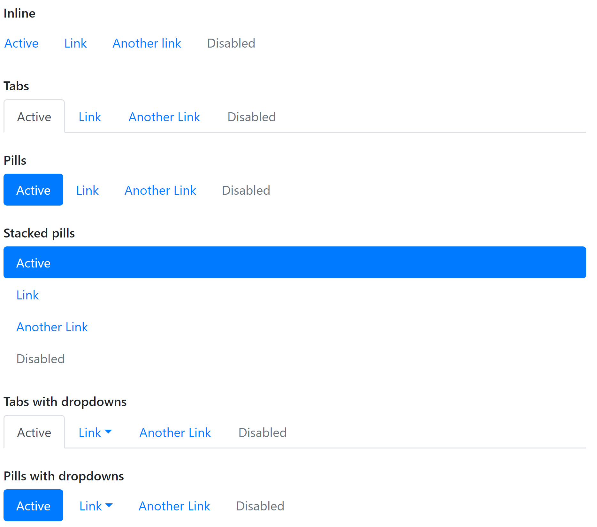
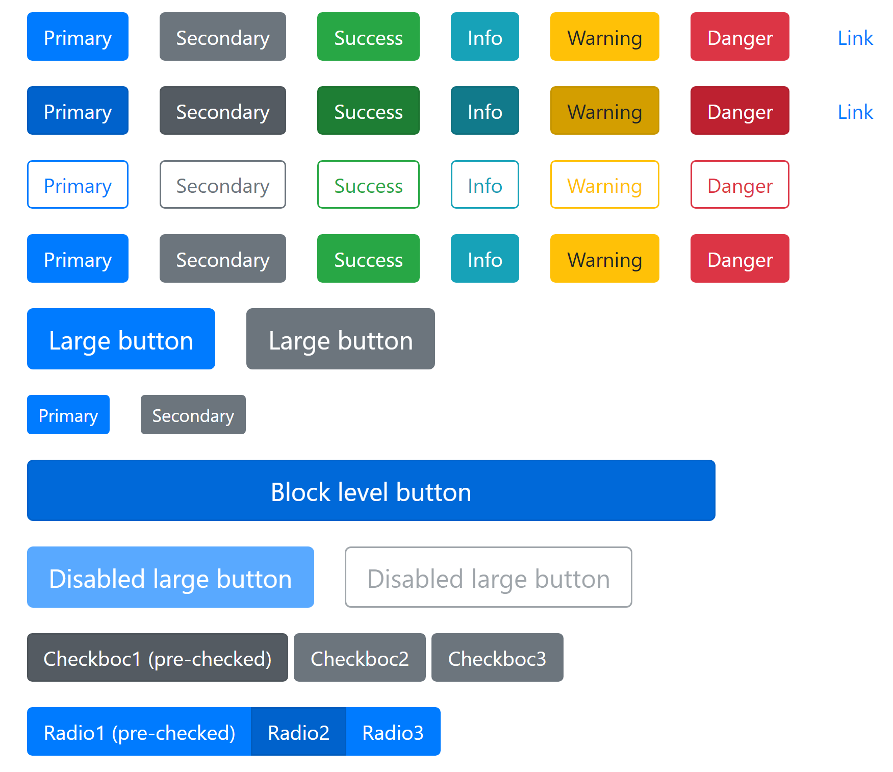
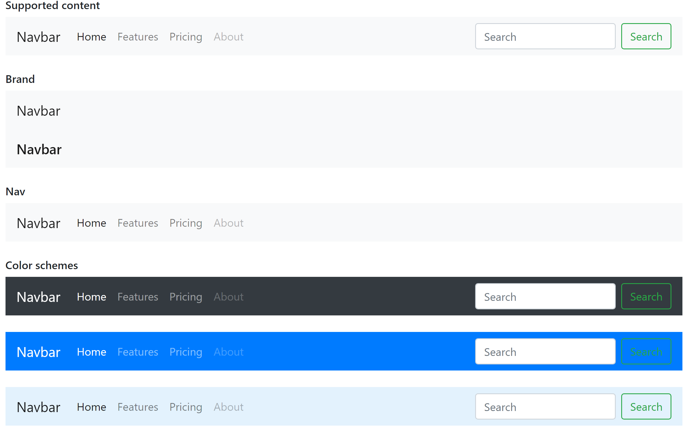
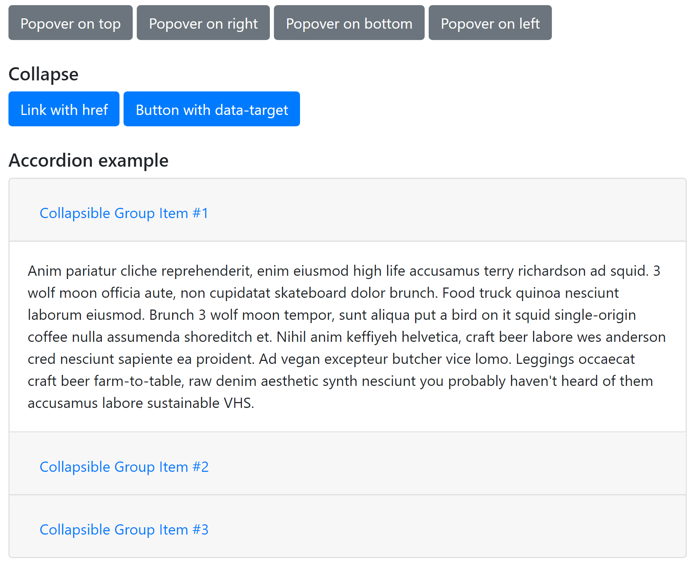

An example of using Bootstrap library components.

## The purpose of the project
Learn and use the Bootstrap library.

## How to use
Select the desired component folder at the root of the project and open index.html in the browser.

## List of components used
* Alert
* Breadcrumb
* Button
* Button dropdown
* Card
* Carousel
* Code
* Form 
* Image 
* Input group
* List group
* Media object
* Nav
* Navbar
* Paginations
* Popover
* Progres
* Reboot
* Scroospy and tooltip
* Table
* Typography
* Modal

# Nav

# Button

# Navbar

# Popover
